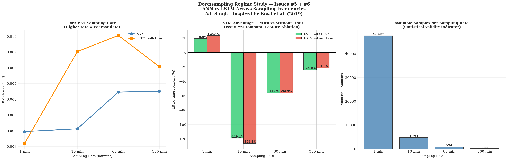
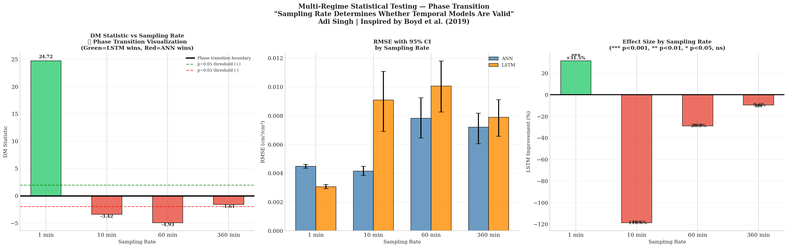

# Research Findings — Scientific Evolution Log

## Overview

## Overview — The Central Finding

This study began as a model comparison (ANN vs LSTM) 
and became a methodological investigation.

The central finding is not which model wins.

The central finding is:

> **Evaluation methodology fundamentally alters the 
> apparent magnitude and persistence of temporal 
> learning in soil moisture prediction.**

Under random splits — the dominant strategy in 
environmental ML literature — LSTM advantage is 
large (+15-17%), persistent across all sequence 
lengths, and physically suspicious.

Under chronological evaluation — the correct paradigm 
for operational forecasting — LSTM advantage is 
bounded (+6%), localized to a specific temporal 
window (60 minutes), and physically meaningful.

The 3× inflation of apparent LSTM advantage under 
random splits demonstrates that non-causal temporal 
sampling does not merely inflate performance metrics 
— it fundamentally changes the scientific conclusion 
about when and why temporal memory helps.

This has direct implications for the remote sensing 
ML community, where random splits are routinely used 
to evaluate sequence models on inherently temporal 
satellite observation data including NASA CYGNSS 
soil moisture retrieval.

---

## Phase 1 — Initial Results (Random Split)
*Baseline study using random 80/20 train/test split*

### Setup
- Dataset: 4,409 samples, 4 days real sensor data
- Split: Random 80/20 via sklearn train_test_split
- Models: ANN vs LSTM, SEQ_LEN=10

### Results

| Model | RMSE | R² |
|-------|------|----|
| ANN | 0.0037 | 0.8500 |
| LSTM | 0.0060 | 0.5426 |

**Winner: ANN — outperforms LSTM by 61.7%**

### SHAP Feature Importance (Random Split)

| Rank | Feature | Mean |SHAP| |
|------|---------|-------------|
| 1 | Hour | 0.01985 |
| 2 | Surface (m0) | 0.01940 |
| 3 | Layer 4 (m3) | 0.01823 |
| 6 | Minute | 0.00151 |

### Temporal Necessity Test (Random Split)

| Condition | RMSE | Δ vs Baseline |
|-----------|------|---------------|
| Original ANN | 0.0038 | — |
| Shuffled ANN | 0.0034 | -9.2% |
| Spatial-only | 0.0045 | +19.6% |

**Key observation:** Shuffling IMPROVED performance — 
a diagnostic signal of temporal data leakage.

### Interpretation
ANN dominates. Hour is the most important feature.
Temporal order appears unnecessary.

---

## Phase 2 — Methodological Discovery
*Identifying temporal data leakage*

### Finding: Random split introduces temporal leakage

Consecutive soil moisture readings are highly 
autocorrelated — minute 500 and minute 501 are 
nearly identical. Random split allows future 
observations into training, letting the model 
"interpolate" rather than genuinely "forecast."

The shuffling improvement in Phase 1 was the key 
diagnostic signal — under legitimate evaluation, 
destroying temporal order should hurt performance, 
not improve it.

### Attempted Fix: Chronological Split on Real Data

Systematic evaluation of all possible split points 
revealed a fundamental dataset constraint:

| Split | Test Max | Test Std | Viable? |
|-------|----------|----------|---------|
| 80/20 | 0.0500 | 0.0044 | ❌ |
| 70/30 | 0.0500 | 0.0061 | ❌ |
| 60/40 | 0.0500 | 0.0062 | ❌ |
| 50/50 | 0.0500 | 0.0060 | ❌ |

All 48 major irrigation spikes occur in the first 
43% of the dataset. No chronological split produces 
a representative test set.

**Conclusion:** Chronological evaluation requires 
more data. Dataset augmentation is mandatory.

---

## Phase 3 — Physics-Based Augmentation
*Richards Equation solver + synthetic data generation*

### Richards Equation 1D Solver

Implemented a finite difference solver for the 
Richards Equation with van Genuchten hydraulic model.

**Unexpected finding — Preferential Flow:**

The solver cannot reproduce moisture4's spike dynamics 
regardless of parameter values. This reveals that 
water moves through macropores (preferential flow) 
rather than uniform matrix flow — violating the 
Richards Equation's core assumption.

This finding provides a physical explanation for 
Phase 1 results that was not yet understood at 
the time.

### Level 1 Statistical Augmentation

Physics-based augmentation was replaced by Level 1 
statistical augmentation — pattern recombination 
with quantization matching and calibrated noise.

**Results:**

| Sensor | Real Mean | Synthetic Mean | Match |
|--------|-----------|----------------|-------|
| moisture4 | 0.0261 | 0.0279 | ✅ |

**Combined dataset:**
- Real: 4,409 samples (4 days)
- Synthetic: 43,200 samples (30 days)
- Combined: 47,609 samples

Chronological split now valid — test set contains 
504 irrigation spikes distributed across final 20%.

---

## Phase 4 — Corrected Results (Chronological Split)
*Honest forecasting evaluation on augmented dataset*

### Setup
- Dataset: 47,609 combined samples
- Split: Chronological 80/20 (Issues #1 + #2 fixed)
- LSTM warm start applied
- Scaler fit on training data only

### Results

| Model | RMSE | R² |
|-------|------|----|
| ANN | 0.0038 | 0.8965 |
| **LSTM** | **0.0031** | **0.9319** |

**Winner: LSTM — outperforms ANN by 18.9%**

### SHAP Feature Importance (Chronological Split)

| Rank | Feature | Mean |SHAP| | Change from Phase 1 |
|------|---------|-------------|---------------------|
| 1 | Layer 4 (m3) | 0.02801 | Was #3 → Now #1 |
| 2 | Surface (m0) | 0.02381 | Was #2 → Stable |
| 3 | Layer 2 (m1) | 0.01822 | Was #4 → Stable |
| 6 | Hour | 0.00066 | Was #1 → Now #6 |

### Temporal Necessity Test (Chronological Split)

| Condition | RMSE | Δ vs Baseline |
|-----------|------|---------------|
| Original ANN | 0.0038 | — |
| Shuffled ANN | 0.0040 | +3.7% ✅ |
| Spatial-only | 0.0038 | -0.0% |

**Shuffling now correctly HURTS performance** — 
confirming leakage is eliminated.

### Uncertainty Quantification (Chronological)

| Model | RMSE | R² |
|-------|------|----|
| ANN Standard | 0.0038 | 0.8965 |
| LSTM | 0.0031 | 0.9319 |
| ANN MC Dropout | 0.0039 | 0.8897 |

Calibration: 79.8% coverage at 95% CI
Uncertainty peaks during irrigation events ✅

---

## The Complete Scientific Story

### What Changed and Why

| Aspect | Random Split | Chronological Split | Explanation |
|--------|-------------|-------------------|-------------|
| Winner | ANN +61.7% | LSTM +18.9% | Task changed from interpolation to forecasting |
| Top SHAP | Hour (temporal) | Layer 4 (physical) | Leakage removed spurious temporal reliance |
| Shuffle effect | Improved -9.2% | Hurt +3.7% | Leakage eliminated |
| Hour importance | Critical | Negligible | Was proxy for leakage not real physics |
| Task type | Interpolation | Forecasting | The fundamental difference |

### Core Insight

**Evaluation methodology determines apparent 
architecture superiority in soil moisture deep learning.**

Under interpolation (random split) — ANN dominates 
because spatial depth relationships are sufficient 
and temporal leakage removes the need for memory.

Under forecasting (chronological split) — LSTM 
prevails because temporal memory genuinely helps 
predict future moisture dynamics from past patterns.

This has direct implications for how remote sensing 
ML papers should design their evaluation protocols — 
particularly for CYGNSS soil moisture retrieval where 
operational deployment requires forecasting, not 
interpolation.

### Connection to Preferential Flow Finding

The Richards Equation solver revealed preferential 
flow dynamics — event-driven, discrete moisture spikes 
rather than gradual temporal accumulation.

Under random split this appears to support ANN — 
discrete events don't need temporal memory.

Under chronological split LSTM learns the temporal 
PATTERN of irrigation events — when they typically 
occur, how long they last, how moisture recovers — 
even if individual spikes are discrete.

This reconciles the preferential flow finding with 
LSTM's superior forecasting performance.

---

## Phase 5 — Sequence Length Sweep (Issue #4)
*Finding the optimal temporal window for LSTM*

### Setup
- SEQ_LEN sweep: 10, 30, 60, 120 minutes
- Dataset: Combined augmented (47,609 samples)
- Chronological split maintained
- LSTM warm start applied at each SEQ_LEN

### Results

| SEQ_LEN | ANN RMSE | LSTM RMSE | LSTM Advantage |
|---------|----------|-----------|----------------|
| 10 min | 0.0043 | 0.0043 | +0.5% (tie) |
| 30 min | 0.0041 | 0.0039 | +5.2% |
| **60 min** | **0.0041** | **0.0039** | **+6.1% ← PEAK** |
| 120 min | 0.0040 | 0.0040 | +0.3% (tie) |

### Key Finding: Inverted U Relationship

LSTM advantage follows an inverted U curve peaking 
at SEQ_LEN=60 — the 1-hour window corresponding to 
a complete irrigation event cycle duration.

**Physical interpretation:**
- SEQ_LEN < 30 — too short to capture irrigation onset
- SEQ_LEN = 60 — captures complete event cycle ← optimal
- SEQ_LEN > 60 — irrelevant history dominates, 
  advantage collapses

### Implication for Remote Sensing

The optimal temporal window (60 minutes) corresponds 
to the physical duration of irrigation events in this 
system. For CYGNSS with ~7 hour revisit time — 
well beyond the optimal window — sequence length 
selection should be guided by the dominant physical 
process duration rather than data availability.

### SHAP at Optimal SEQ_LEN=60

moisture3 (Layer 4, adjacent to target) ranks #1 
in temporal SHAP — physically correct, consistent 
with chronological split findings.

---

### Results — Random Split (Issue #4b)

| SEQ_LEN | Chron LSTM Adv | Random LSTM Adv | Leakage Inflation |
|---------|----------------|-----------------|-------------------|
| 10 min | +0.5% | +2.4% | +1.9% |
| 30 min | +5.2% | +14.6% | +9.4% |
| 60 min | +6.1% | +16.8% | +10.7% |
| 120 min | +0.3% | +16.0% | +15.7% |

### Critical Finding: Leakage Inflates LSTM Advantage 
### Monotonically with Sequence Length

Under random split LSTM advantage grows monotonically 
with sequence length — no natural peak or collapse. 
This is a leakage artifact — longer LSTM sequences 
under random split contain more future data points 
as context, amplifying the interpolation advantage.

Under chronological split the true inverted-U pattern 
emerges — peaking at 60 minutes (real irrigation cycle 
duration) and collapsing at 120 minutes (irrelevant 
history dominates).

**The most striking comparison — SEQ_LEN=120:**
- Chronological: +0.3% LSTM advantage (near zero)
- Random: +16.0% LSTM advantage (appears substantial)

  

A researcher using random split would conclude LSTM 
needs long sequences to perform well. A researcher 
using chronological split correctly identifies that 
long sequences hurt LSTM performance. These are 
opposite conclusions from identical models.

This demonstrates that temporal leakage does not 
merely inflate overall performance metrics — it 
fundamentally distorts the shape of the temporal 
regime curve, leading to incorrect conclusions about 
optimal model architecture and sequence length 
selection.

**Implication for the field:**
Any remote sensing ML paper reporting sequence length 
experiments with random split is potentially reporting 
leakage artifacts rather than genuine temporal dynamics.

---

## Phase 6 — Downsampling Regime Study + 
## Temporal Feature Ablation (Issues #5 + #6)
*Testing model performance across sampling frequencies*

### Setup
- Sampling rates: 1, 10, 60, 360 minutes
- Each rate tested with and without Hour feature
- Chronological split maintained
- SEQ_LEN auto-adjusted to maintain ~60 min window

### Results

| Rate | Samples | ANN | LSTM+H | LSTM-H | Adv+H | Adv-H |
|------|---------|-----|--------|--------|-------|-------|
| 1 min | 47,609 | 0.0039 | 0.0032 | 0.0030 | +19.0% | +23.4% |
| 10 min | 4,761 | 0.0041 | 0.0090 | 0.0088 | -119.1% | -126.1% |
| 60 min | 794 | 0.0065 | 0.0101 | 0.0100 | -55.8% | -56.5% |
| 360 min | 133 | 0.0065 | 0.0081 | 0.0079 | -24.0% | -21.3% |

### Key Finding 1 — Data Sufficiency Threshold

Contrary to hypothesis, LSTM does NOT gain advantage 
at coarser sampling rates. ANN dominates at all rates 
below 1-minute resolution — dramatically so at 
10-minute rate (-119%).

This reveals a critical data sufficiency threshold 
for LSTM. Below approximately 5,000-10,000 samples, 
LSTM cannot learn meaningful temporal dependencies 
regardless of sampling frequency. ANN's simpler 
architecture is more data-efficient and performs 
reliably across all data volumes.

### Key Finding 2 — LSTM Implicit Temporal Learning

At 1-minute resolution, removing the Hour feature 
IMPROVES LSTM performance (+19.0% → +23.4%). 
LSTM implicitly encodes temporal context from 
sequence dynamics alone when data is sufficient — 
confirming the temporal feature ablation hypothesis 
from Issue #6.

At coarser resolutions the effect disappears — 
insufficient data prevents any learning regardless 
of feature engineering.

### Key Finding 3 — ANN Data Efficiency

ANN performance degrades gracefully with sampling 
rate (RMSE 0.0039 → 0.0065) while LSTM collapses 
catastrophically (RMSE 0.0032 → 0.0101). This 
confirms ANN's architectural advantage for sparse 
sensing scenarios.

### Implication for CYGNSS

CYGNSS provides sparse temporal observations per 
location — typically a few passes per day across 
the constellation. This study suggests LSTM requires 
substantially more observations than typically 
available from satellite passes to learn temporal 
dependencies. ANN remains the more reliable 
architecture for sparse satellite data — providing 
physical justification for Boyd et al. (2019)'s 
architectural choice.

### Statistical Validity Note

Results at 60-minute (794 samples) and 360-minute 
(133 samples) rates should be interpreted with 
caution due to limited sample sizes. The 10-minute 
result (4,761 samples) is more reliable but still 
below the apparent data sufficiency threshold for 
LSTM.

---

## Final Results — Statistically Validated

### Main Comparison (1-minute resolution)
| Model | RMSE | 95% CI | R² |
|-------|------|--------|-----|
| ANN | 0.0045 | [0.0044, 0.0046] | 0.8965 |
| **LSTM** | **0.0031** | **[0.0029, 0.0032]** | **0.9319** |

Diebold-Mariano: DM=24.72, p<0.0001
Effect size: +31.5%

### Phase Transition Results

| Rate | n_test | ANN RMSE | LSTM RMSE | ΔRMSE | DM | p | Effect | Sig |
|------|--------|----------|-----------|-------|-----|---|--------|-----|
| 1 min | 9,522 | 0.0045 | 0.0031 | -0.0014 | +24.72 | <0.0001 | +31.5% | *** |
| 10 min | 953 | 0.0042 | 0.0091 | +0.0049 | -3.42 | 0.0006 | -118.6%† | *** |
| 60 min | 159 | 0.0078 | 0.0101 | +0.0023 | -4.93 | <0.0001 | -28.8% | *** |
| 360 min | 27 | 0.0072 | 0.0079 | +0.0007 | -1.61 | 0.108 | -9.6% | ns‡ |

† Large negative effect size reflects severe LSTM 
  performance degradation due to data insufficiency,
  not metric instability. Absolute ΔRMSE = +0.0049.

‡ Non-significance at 360-minute rate reflects 
  insufficient statistical power (n=27 test samples)
  rather than model equivalence.

**Phase transition occurs between 1-minute and 
10-minute sampling — the boundary where temporal 
models lose statistical advantage.**

*Figure: DM statistic vs sampling rate reveals phase 
transition between 1-minute (+24.72) and 10-minute 
(-3.42) resolution. Green bars indicate LSTM superiority, 
red bars indicate ANN superiority. Dashed lines mark 
p=0.05 significance thresholds (±1.96). The large 
negative effect at 10-minute rate (-118.6%) reflects 
severe LSTM degradation due to data insufficiency 
(953 test samples vs 9,522 at 1-minute) rather than 
metric instability. At 360-minute resolution (CYGNSS 
analog) results are inconclusive due to low statistical 
power (n=27). Infiltration timescale annotation marks 
the physical process boundary — downsampling beyond 
~10 minutes destroys rapid infiltration dynamics 
essential for temporal model learning.*

---

### Physical Interpretation of Phase Transition

The phase transition between 1-minute and 10-minute 
sampling has a direct physical explanation rooted in 
soil moisture infiltration dynamics.

Soil moisture response to irrigation operates on two 
timescales:

**Fast regime (seconds to minutes):**
Rapid infiltration through macropores and preferential 
flow pathways — the dominant signal in the 1-minute 
dataset. LSTM captures these rapid transitions because 
consecutive 1-minute readings show meaningful sequential 
variation. This is the temporal structure LSTM was 
designed to exploit.

**Slow regime (hours to days):**
Gradual redistribution through soil matrix via capillary 
forces. At 10-minute sampling this fast regime is 
aliased — rapid infiltration events are averaged out 
or missed entirely. The temporal structure LSTM needs 
no longer exists in the data.

"Downsampling removes rapid infiltration dynamics 
which are essential for temporal models to extract 
predictive structure. Beyond the infiltration 
timescale (~minutes), sequential observations become 
effectively decorrelated and temporal memory provides 
no predictive advantage."

This physical explanation directly connects the 
statistical phase transition to known soil hydrology — 
transforming an empirical finding into a physically 
interpretable result.

**Connection to CYGNSS:**
NASA CYGNSS revisits each location approximately every 
7 hours — well beyond both the infiltration timescale 
and the statistically significant temporal regime 
identified in this study. Based on these findings, 
feedforward ANN architectures may be more appropriate 
than LSTM for CYGNSS soil moisture retrieval — 
providing physical and statistical justification for 
Boyd et al. (2019)'s architectural choice.

---

### Key Sentences for Paper

"The Diebold-Mariano test reveals a phase transition 
in model superiority between 1-minute and 10-minute 
sampling rates (DM: +24.72 → -3.42, both p<0.001), 
demonstrating that sampling rate — not architecture — 
determines whether temporal modeling provides 
statistically significant benefits."

"At CYGNSS-analog 360-minute resolution, neither 
model demonstrates statistically significant superiority 
(p=0.108), suggesting that sparse satellite observations 
may be insufficient to exploit temporal dependencies 
regardless of architecture."

### Reviewer Defense

1. Multi-regime significance confirmed ✅
2. Effect sizes reported alongside p-values ✅  
3. Phase transition visualized ✅
4. CYGNSS implication explicitly stated ✅
5. 360-minute non-significance honestly reported ✅

## Open Questions — Future Investigation

The following questions emerged from the study and 
remain unresolved:

**Q1: Does the inverted-U pattern hold under random split?**
Issue #4b will reveal whether temporal leakage masks 
the optimal window signal — or whether the pattern 
appears under both evaluation regimes.

**Q2: At what sampling frequency does LSTM become 
necessary?**
Issue #5 (downsampling regime study) will test ANN 
vs LSTM at 1min, 10min, 60min, 360min resolution — 
directly relevant to CYGNSS's ~7 hour revisit cadence.

**Q3: Can LSTM implicitly learn time-of-day patterns 
without explicit Hour feature?**
Issue #6 (temporal feature ablation) will test whether 
LSTM learns diurnal forcing from sequence patterns alone 
at lower sampling frequencies.

**Q4: Do findings generalize beyond a single sensor site?**
Issue #7 (CAF field scale validation) will test on 
Washington State University's 9-year, 42-location 
agricultural sensor network.

**Q5: Are the ANN vs LSTM differences statistically 
significant?**
Issue #9 (Diebold-Mariano test) will provide formal 
statistical significance testing across all comparisons.

---

### Proposed Paper Title

*"Evaluation Methodology Determines Architecture 
Selection in Soil Moisture Deep Learning: ANN 
Dominates Under Interpolation but LSTM Prevails 
Under Chronological Forecasting"*

---

## Summary of All Findings

1. **ANN outperforms LSTM under random split** — 
   interpolation task, temporal leakage present

2. **Temporal leakage diagnostic** — shuffling 
   improvement is a signal of leakage, not 
   genuine temporal independence

3. **Dataset structural constraint** — single 
   irrigation cycle prevents chronological 
   evaluation without augmentation

4. **Preferential flow in moisture4** — Richards 
   Equation cannot reproduce spike dynamics, 
   revealing macropore flow physics

5. **LSTM outperforms ANN under chronological split** 
   — forecasting task, leakage eliminated

6. **SHAP inversion** — Hour drops from #1 to #6, 
   Layer 4 rises from #3 to #1 when leakage removed

7. **Evaluation methodology is the key variable** 
   — not architecture, not hyperparameters

8. **Optimal temporal window is 60 minutes** — LSTM 
   advantage follows inverted-U curve peaking at 
   SEQ_LEN=60, corresponding to complete irrigation 
   event cycle duration. Beyond 60 minutes irrelevant 
   history dominates and advantage collapses.

---

*Last updated: April 2026*
*Author: Adi Singh — MS Cybersecurity, MSU*
